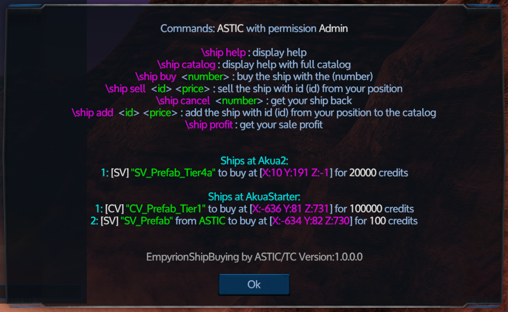

# EmpyrionShipBuying
## Installation
1. Download der aktuellen ZIP datei von https://github.com/GitHub-TC/EmpyrionShipBuying/releases
1. Upload der Datei im EWA (EmpyrionWebAccess) MOD oder händische installation mit dem ModLoader aus https://github.com/GitHub-TC/EmpyrionShipBuying

## Wo für ist das?
Hiermit können Schiffe aus einem Katalog oder von Spielern (über den Fraktionschat) gehandelt werden.

Dabei bestimmt die Position des Verkäufers beim Verkauf automatisch die spätere Position in dessen Nähe sich der Käufer befinden muss.
Auch die Postion des Schiffes beim Verkauf ist die gleiche, an der das Schiff beim Kauf in das Spiel eingefügt wird.

#### Schiffe im Katalog zur Verfügung stellen:
* Als erstes stelle dich an die Stelle von wo aus der spätere Kauf getätigt werden soll.
Dann gibst du folgenden Befehl ein: \\ship add &lt;ID&gt; &lt;Preis&gt; und Entertaste wobei die erste Zahl der ID des zu verkaufenden Schiffes ist.
* Das Schiff wird nun aus dem Spiel gelöscht und in dem Verzeichnis der Mod hinterlegt

#### Schiffe verkaufen:
* Als erstes stelle dich an die Stelle von wo aus der spätere Kauf getätigt werden soll.
Dann gibst du folgenden Befehl ein: \\ship sell &lt;ID&gt; &lt;Preis&gt; und Entertaste wobei die erste Zahl der ID des zu verkaufenden Schiffes ist.
* Das Schiff wird nun aus dem Spiel gelöscht und in dem Verzeichnis der Mod hinterlegt
* Du kannst das Verkaufsangebot des Schiff wieder zurücknehmen und bekommst gegen eine kleine Gebühr (i.d.R. 10% des Verkaufspreises) dein Schiff wieder

#### Schiffe kaufen:
* Wenn dies nicht durch LCDs etc. kenntlich gemacht wurde ermittle die Kaufposition mit Hilfe des Kommandos "\\ship help" im Fraktionschat
* Begib dich dich an die Stelle von wo aus der Kauf getätigt werden kann.
* Nun kannst du per "\\ship buy &lt;number&gt;" das Shiff aus der Liste kaufen die an dieser Position angeboten werden
* Wenn der Kauf erfolgreich war wird das Schiff an der Verkaufsposition für dich privat zur Verfügung gestellt

## Kommandos
Die Kommandos funktionieren NUR im Fraktionschat!

* \\ship help =&gt; Liste der Kommandos und der zum Kauf angebotenen Schiffe in diesem Playfield
* \\ship catalog =&gt; Liste der Kommandos und der zum Kauf angebotenen Schiffe über alle Playfields
* \\ship buy &lt;number&gt; =&gt; Startet den Kauf des Schiffes der Position &lt;number&gt; aus der Liste
* \\ship sell &lt;id&gt; &lt;price&gt; =&gt; Verkauft das Schiff mit der Id &lt;id&gt; und seinem ganzen Inhalt zu dem Preis &lt;price&gt;
* \\ship cancel &lt;number&gt; =&gt; Zieht den Verkauf des Schiffes an der Position &lt;number&gt; zurück. Hierbei fallen "Transaktionsgebühren" in Höhe von 10% an
* \\ship add &lt;id&gt; &lt;price&gt; =&gt; Stellt das das Schiff mit der Id &lt;id&gt; und seinem ganzen Inhalt zu dem Preis &lt;price&gt; in den Verkaufskatalog so das dies mehrfach gekauft werden kann
* \\ship profit =&gt; Transferiert den Gewinn der aus den Schiffsverkäufen erzielt wurde.

#### Schiffe via EPB Datei anbieten
Zunächst einfach einen 'normalen' Verkauf mit einer gespawten Version des Schiffes durchführen. 
Danach kann im \[SaveGamePath\]\\Mods\\EmpyrionShipBuying\\ShipsData die EPB Datei abgelegt werden und der Dateiname in der Konfiguration im Abschnitt StructureDirectoryOrEBPName des Schiffes eingetragen werden.
Hier können natürlich auch der Name und die Detailinformationen jederzeit geändert werden

## Konfiguration
* LogLevel: Steuerung des Loggings
* ChatCommandPrefix: Zeichenfolge mit dem die Chatkommandos beginnen müssen
* SellPermission: Berechtigungen zum Verkauf von Schiffen
* AddPermission: Beretigung zum hinzufügen von Schiffen zu dem Katalog
* MaxBuyingPosDistance: Maximaler Abstand zu der Kaufposition
* CancelPercentageSaleFee: Bestimmt wie viel Prozent Transaktionsgebühren fällig sind wenn ein Verkauf zurückgezogen wird
* ForbiddenPlayfields: Liste von Playfield in denen kein Schiff zum Verkauf angeboten werden darf (i.d.R. wird man hier PvP Playfields eintragen)
* Ships
    * DisplayName: Name des Schiffes
    * EntityType: Schiffstyp (HV, SV, CV)
    * StructureDirectoryOrEPBName: Verzeichnisname oder Dateiname der EPB Datei im 'ShipsData' Verzeichnis der Mod
    * ShipDetails: Detailinformationen über das Schiff
    * Price: Preis
    * Seller: Name des Verkäufers
    * SellerId: Wenn es sich um einen einfachen Verkauf handelt ist dies die EntityId des Spielers sonst ist sie 0
    * OnetimeTransaction: Handelt es sich um einen einmaligen Verkauf
    * SpawnLocation: Position &amp; Rotation an der das Schiff erzeugt wird
    * BuyLocation: Position an der ein Spieler beim Kauf stehen muss
* SaleProfits: Liste der EntiyIds der Spieler und ihr noch nicht abgeholter Verkaufserlös

***

English-Version:

---

# Empyrion ShipBuying
## installation
1. Download the latest ZIP file from https://github.com/GitHub-TC/EmpyrionShipBuying/releases
1. Upload the file in the EWA (EmpyrionWebAccess) MOD or manual installation with the ModLoader from https://github.com/GitHub-TC/EmpyrionShipBuying

## What is it for?
This can be used to trade ships from a catalog or from players (via the faction).

The position of the seller in the sale automatically determines the future position near which the buyer must be.
Also, the ship's position in the sale is the same as when the ship is inserted into the game when purchased.

#### Provide ships in the catalog:
* First, imagine where the future purchase should be made from.
Then enter the following command: \\ship add &lt;ID&gt; &lt;price&gt; and Enter key where the first number is the ID of the ship to be sold.
* The ship is now deleted from the game and deposited in the directory of the mod

#### Ships sell:
* First, imagine where the future purchase should be made from.
Then enter the following command: \\ship sell &lt;ID&gt; &lt;price&gt; and Enter key where the first number is the ID of the ship to be sold.
* The ship is now deleted from the game and deposited in the directory of the mod
* You can take back the offer of sale of the ship and get back your ship for a small fee (10% of the selling price)

#### Buy ships:
* If this was not indicated by LCDs, etc. determine the purchase position with the help of the command "\\ship help" in the parliamentary group
* Go to the place where the purchase can be made.
* Now you can buy via "\\ship &lt;number&gt;" Buy the ship from the list offered at this location
* If the purchase was successful, the ship will be privately made available to you at the point of sale

## Commands
The commands work ONLY in the fractional vote!

* \\ship help =&gt; List of commands and boats available for purchase in this playfield
* \\ship catalog =&gt; List of commands and boats available for purchase across all playfields
* \\ship buy &lt;number&gt; =&gt; Starts the purchase of the ship of position &lt;number&gt; from the list
* \\ship sell &lt;id&gt; &lt;price&gt; =&gt; Sold the ship with Id &lt;id&gt; and all its content at the price &lt;price&gt;
* \\ship cancel &lt;number&gt; =&gt; Attracts the sale of the ship at the position &lt;number&gt; back. In this case, "transaction fees" amounting to 10%
* \\ship add &lt;id&gt; &lt;price&gt; =&gt; Does that put the ship with Id &lt;id&gt; and all its content at the price &lt;price&gt; in the sales catalog so that this can be bought several times
* \\ship profit =&gt; Transfers the profit made from ship sales.

#### Offer ships via EPB file
First, just do a 'normal' sale with a pawed version of the ship.
Then the EPB file can be stored in \[SaveGamePath\]\\Mods\\EmpyrionShipBuying\\ShipsData and the file name can be entered in the configuration in the section StructureDirectoryOrEBPName of the ship.
Here, of course, the name and the detailed information can be changed at any time

## Configuration
* LogLevel: Logging control
* ChatCommandPrefix: string with which the chat commands have to start
* SellPermission: permissions to sell ships
* AddPermission: Necessity to add ships to the catalog
* MaxBuyingPosDistance: Maximum distance to the buy position
* CancelPercentageSaleFee: Determines what percentage transaction fees are due when a sale is withdrawn
* ForbiddenPlayfields: List of Playfields in which no ship may be offered for sale (here you will enter PvP Playfields here)
* Ships
    * DisplayName: name of the ship
    * EntityType: Ship type (HV, SV, CV)
    * StructureDirectoryOrEPBName: directory name or file name of the EPB file in the 'ShipsData' directory of the mod
    * ShipDetails: detailed information about the ship
    * Price: Price
    * Seller: Name of the seller
    * SellerId: If it is a simple sale this is the EntityId of the player otherwise it is 0
    * OnetimeTransaction: Is it a one time sale
    * SpawnLocation: Position & amp; Rotation at which the ship is generated
    * BuyLocation: position where a player has to stand when buying
* SaleProfits: List of player's assets and their unclaimed sales proceeds